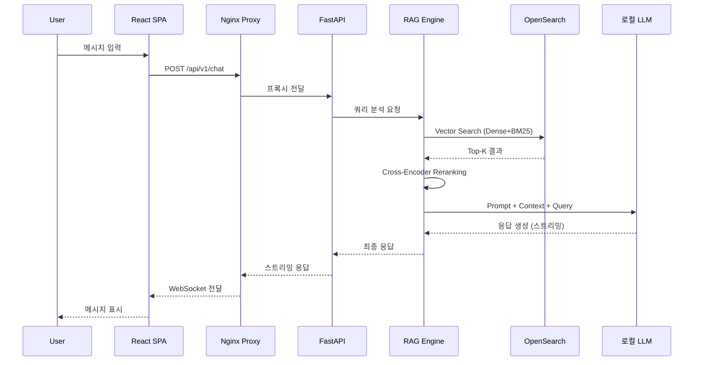

# 01. 시스템 아키텍처 개요

## 전체 구성도

```mermaid
graph TB
    subgraph "Client Layer"
        Browser[웹 브라우저]
    end
    
    subgraph "Frontend Layer"
        ReactSPA[React SPA<br/>chatbot.example.com]
        Nginx[Nginx Reverse Proxy<br/>Static Files + SSL]
    end
    
    subgraph "API Gateway"
        FastAPI[FastAPI Backend<br/>REST + WebSocket]
        Auth[API Key 인증 미들웨어]
    end
    
    subgraph "RAG Engine"
        QueryParser[쿼리 파서 & 전처리]
        Embedding[임베딩 생성기]
        VectorSearch[OpenSearch k-NN Search]
        Ranker[Cross-Encoder Ranker]
        RRF[Reranker (RRF)]
    end
    
    subgraph "LLM Layer"
        LLM[로컬 LLM API<br/>http://127.0.0.1:11434]
        PromptEngine[Prompt Engineering]
        ContextBuilder[Context Builder]
    end
    
    subgraph "Data Pipeline"
        DocumentLoader[문서 로더 (TXT, MD, PDF)]
        Chunker[청커]
        EmbeddingStore[(OpenSearch Index)]
    end
    
    subgraph "Memory Layer"
        Redis[(Redis<br/>Short-Term Memory)]
        PostgreSQL[(PostgreSQL<br/>Long-Term Memory)]
    end
    
    Browser -->|HTTP| Nginx
    Nginx -->|정적 파일| ReactSPA
    Nginx -->|/api/* 프록시| FastAPI
    Nginx -->|/ws/* WebSocket| FastAPI
    
    ReactSPA -->|채팅 메시지| Nginx
    Nginx --> FastAPI
    FastAPI --> Auth
    Auth --> QueryParser
    QueryParser --> Embedding
    Embedding --> VectorSearch
    VectorSearch --> Ranker
    Ranker --> RRF
    RRF --> ContextBuilder
    ContextBuilder --> PromptEngine
    PromptEngine --> LLM
    LLM -->|응답| ReactSPA
    
    DocumentLoader --> Chunker
    Chunker --> Embedding
    Embedding --> EmbeddingStore
    
    QueryParser --> Redis
    ContextBuilder --> PostgreSQL
```

## 기술 스택

| 레이어 | 기술 | 비고 |
|--------|------|------|
| Frontend | React 18 + TypeScript + Vite | chatbot.example.com 도메인 |
| Web Server | Nginx (Reverse Proxy) | HTTP, WebSocket 프록시 |
| API Gateway | FastAPI (Python 3.11+) | REST + WebSocket 지원 |
| Vector DB | OpenSearch 2.x+ (k-NN plugin) | k-NN 검색 플러그인 필수 |
| Embedding Model | sentence-transformers/all-MiniLM-L6-v2 | 또는 한국어 특화 모델 |
| Reranker | BAAI/bge-reranker-v2-m3 | 다국어 지원, 성능 우수 |
| LLM | LMStudio (OpenAI 호환) | http://127.0.0.1:1234/v1 |
| Document Pipeline | LangChain / PyMuPDF / markdown2 | 문서 파싱 및 청킹 |
| Session Storage | Redis + PostgreSQL | 단기/장기 메모리 분리 |

## LLM API (LMStudio)

- **URL**: `http://127.0.0.1:1234/v1`
- **호환성**: OpenAI API 호환 (chat completions, embeddings)
- **사용 모델**: qwen3.6-35b-a3b-claude-4.7-opus-reasoning-distilled-apex

## 데이터 흐름 (채팅)



## 주요 특징

- **RAG 기반**: OpenSearch k-NN 검색 + Cross-Encoder 랭킹으로 정확한 응답 제공
- **다중 문서 지원**: TXT, MD, PDF (텍스트 + 이미지 OCR)
- **실시간 스트리밍**: WebSocket을 통한 LLM 응답 스트리밍
- **메모리 아키텍처**: 단기 기억(Redis) + 장기 기억(PostgreSQL)
- **API Key 인증**: 보안 강화된 API 접근 제어
