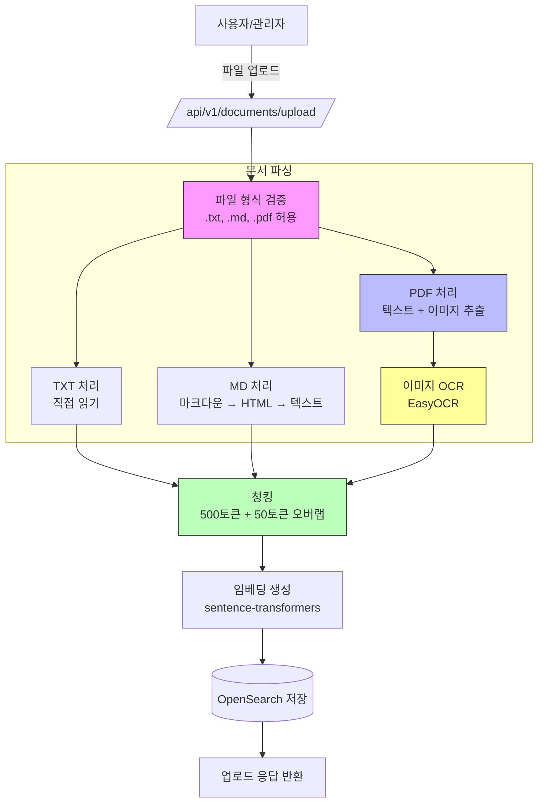

# 02. 데이터 파이프라인 (문서 업로드 및 벡터화)

## 지원 파일 형식

| 형식 | 설명 | 사용 라이브러리 | 처리 방식 |
|------|------|-----------------|-----------|
| `.txt` | 일반 텍스트 파일 | Python 내장 `open()` | 전체 내용을 텍스트로 읽음 |
| `.md` | Markdown 문서 | `markdown2`, `mistletoe` | 마크다운 파싱 → 순수 텍스트 추출 |
| `.pdf` | PDF 문서 (텍스트+이미지) | `pymupdf`(PyMuPDF), `pdfplumber`, `easyocr` | 텍스트 추출 + 이미지 OCR |

## 업로드 API 엔드포인트

```python
# POST /api/v1/documents/upload
# Header: X-API-Key: <your-api-key>
# Content-Type: multipart/form-data

요청:
{
    "file": <binary file>,           # .txt, .md 또는 .pdf 파일
    "metadata": {                     # 선택사항
        "title": "문서 제목",
        "category": "카테고리명",
        "tags": ["태그1", "태그2"]
    }
}

응답 (200 OK):
{
    "document_id": "doc_abc123",
    "status": "processing",           # processing | completed | failed
    "chunks_count": 15,
    "images_extracted": 3,            # PDF인 경우 추출된 이미지 수
    "message": "문서가 성공적으로 업로드되었습니다."
}
```

## 문서 파싱 로직 (Pseudo-code)

```python
async def parse_document(file_path: str, file_type: str) -> List[str]:
    """문서 파일을 읽고 텍스트 청크로 분할"""
    
    if file_type == "txt":
        content = await read_text_file(file_path)
        
    elif file_type == "md":
        # Markdown 파싱 → HTML → 순수 텍스트 추출
        html = markdown2.markdown(content_raw)
        content = extract_text_from_html(html)
        
    elif file_type == "pdf":
        # PDF 처리: 텍스트 + 이미지 분리 추출
        text_content, images = await parse_pdf_with_images(file_path)
        # 이미지에 대한 OCR 수행
        for img in images:
            ocr_text = await perform_ocr(img)
            content += f"[이미지 설명: {ocr_text}]"
        
    else:
        raise ValueError(f"지원하지 않는 파일 형식: {file_type}")
    
    return chunk_text(content, chunk_size=500, overlap=50)


async def parse_pdf_with_images(pdf_path: str) -> Tuple[str, List[Image]]:
    """PDF에서 텍스트와 이미지를 분리 추출"""
    import fitz  # PyMuPDF
    
    doc = fitz.open(pdf_path)
    full_text = ""
    images = []
    
    for page_num in range(len(doc)):
        page = doc.load_page(page_num)
        
        # 1. 텍스트 추출 (페이지별 메타데이터 유지)
        text = page.get_text()
        full_text += f"[Page {page_num + 1}] {text}\n"
        
        # 2. 이미지 추출
        image_list = page.get_images(full=True)
        for img_index, img in enumerate(image_list):
            xref = img[0]
            base_image = doc.extract_image(xref)
            image_bytes = base_image["image"]
            
            from PIL import Image
            import io
            img_obj = Image.open(io.BytesIO(image_bytes))
            images.append({
                "page": page_num + 1,
                "index": img_index,
                "data": img_obj,
                "format": base_image["ext"]
            })
    
    doc.close()
    return full_text, images


async def perform_ocr(image: Image) -> str:
    """이미지에서 텍스트 추출 (OCR)"""
    import easyocr
    
    reader = easyocr.Reader(['ko', 'en'], gpu=False)
    result = reader.readtext(image)
    
    ocr_text = " ".join([item[1] for item in result])
    return ocr_text


def chunk_text(text: str, chunk_size: int = 500, overlap: int = 50) -> List[str]:
    """텍스트를 의미 있는 청크로 분할"""
    paragraphs = text.split('\n\n')
    
    chunks = []
    current_chunk = ""
    
    for para in paragraphs:
        if len(current_chunk) + len(para) > chunk_size:
            chunks.append(current_chunk.strip())
            if overlap > 0 and chunks:
                prev_last = chunks[-1].split()[-overlap:] if len(chunks[-1].split()) >= overlap else []
                current_chunk = " ".join(prev_last) + " " + para
            else:
                current_chunk = para
        else:
            current_chunk += "\n\n" + para
    
    if current_chunk.strip():
        chunks.append(current_chunk.strip())
    
    return chunks
```

## Markdown 파일 처리 상세

Markdown 파일은 다음과 같은 구조를 가질 수 있으며, 이를 적절히 파싱해야 합니다:

```markdown
# 문서 제목 (H1) → metadata.title에 저장
## 섹션 제목 (H2) → metadata.section에 저장
### 소제목 (H3) → 하위 컨텍스트로 활용

본문 내용...

- 리스트 항목 1
- 리스트 항목 2

> 인용구 → 별도 메타데이터로 처리 가능
```

**추천 파싱 전략**:
- `markdown2` 라이브러리 사용 (Python)
- HTML 변환 후 BeautifulSoup으로 순수 텍스트 추출
- 헤더 구조를 메타데이터로 유지하여 검색 시 컨텍스트 보강

## PDF 파일 처리 상세

PDF는 다음과 같은 구성 요소를 포함할 수 있으며, 각각을 적절히 처리해야 합니다:

| 요소 | 처리 방식 | 저장 위치 |
|------|-----------|-----------|
| 텍스트 | PyMuPDF로 페이지별 추출 | `text_chunks` 인덱스 |
| 이미지 (내장) | PyMuPDF로 분리 → EasyOCR로 텍스트화 | `image_ocr_text` 인덱스 |
| 표(Table) | pdfplumber로 구조 분석 | `table_data` 인덱스 |
| 메타데이터 | 제목, 작성자, 생성일 등 | 문서 메타데이터 |

**PDF 처리 파이프라인**:
```
1. PyMuPDF로 PDF 열기
2. 페이지별 텍스트 추출 (페이지 번호 메타데이터 포함)
3. 페이지별 이미지 추출 (PIL로 메모리 로드)
4. 각 이미지에 대해 EasyOCR 수행 → 텍스트화
5. 표가 있는 경우 pdfplumber로 구조 분석
6. 모든 텍스트를 청킹하여 OpenSearch에 저장
7. 이미지 OCR 결과는 별도 인덱스에 메타데이터와 함께 저장
```

## 전체 데이터 흐름



## 청킹 전략 상세

| 파라미터 | 값 | 설명 |
|----------|-----|------|
| chunk_size | 500 토큰 | 청크당 최대 토큰 수 |
| overlap | 50 토큰 | 인접 청크 간 중복 토큰 (문맥 유지) |
| separator | `\n\n` | 기본 분할 기준 (문단 단위) |
| min_chunk_size | 100 토큰 | 이보다 작은 청크는 병합 |
