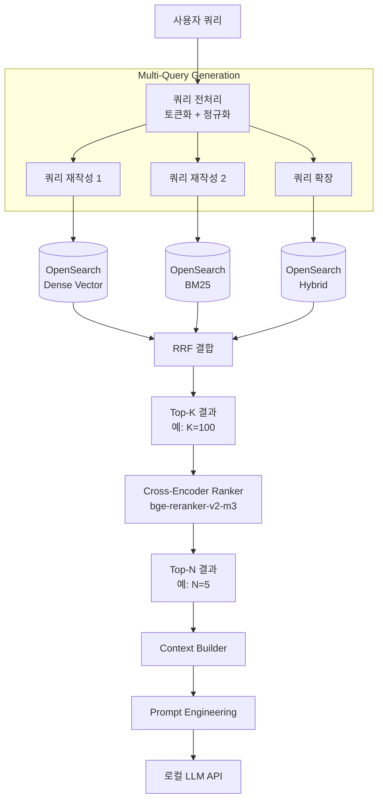

# 03. RAG 엔진 (검색 및 랭킹)

## OpenSearch 검색 정확도 개선 전략

### A. Multi-Vector Search + RRF (Reciprocal Rank Fusion)

단일 쿼리가 아닌, 의미적으로 유사한 여러 쿼리를 생성하여 병렬 검색합니다. 각 인덱스(semantic, keyword, hybrid)에서 반환된 결과를 RRF 알고리즘으로 재순위화합니다.

**RRF 공식**: `score = Σ (1 / (k + rank_i))` (k=60)

### B. Cross-Encoder Ranker (2-stage retrieval)

```
Stage 1: Vector Search (Fast, recall-focused) → Top-K 문서 (예: K=100)
Stage 2: Cross-Encoder Reranker (Slow, precision-focused) → Top-N 문서 (예: N=5)
```

**추천 모델**: `BAAI/bge-reranker-v2-m3`, `jina-reranker-v2-base-multilingual`

Cross-Encoder는 쿼리-문서 쌍을 직접 처리하므로 훨씬 높은 정확도를 제공합니다.

### C. Hybrid Search (Dense + Sparse)

| 방식 | 설명 | 역할 |
|------|------|------|
| Dense Vector | Sentence-BERT 임베딩 | 의미적 유사성 검색 |
| Sparse (BM25) | OpenSearch BM25 | 키워드 매칭 검색 |
| RRF 결합 | 두 결과 조합 | 상호 보완적 검색 |

### D. Query Expansion & Rewriting

- LLM을 활용해 쿼리를 재작성 (Query Rewriting)
- 관련 질문 생성 (Query Expansion)
- 한국어 특화: 형태소 분석기(KoNLPy, Komoran)를 통한 어간 추출

## RAG 엔진 아키텍처



## 검색 파이프라인 상세

### 1. 쿼리 전처리

```python
def preprocess_query(query: str) -> dict:
    """쿼리를 분석하고 여러 변형 생성"""
    
    # 한국어 형태소 분석 (선택사항)
    tokens = tokenize_korean(query)
    
    # 쿼리 재작성 (LLM 활용)
    rewritten_queries = rewrite_query(query)
    
    return {
        "original": query,
        "tokens": tokens,
        "rewritten": rewritten_queries
    }
```

### 2. Multi-Vector Search

```python
async def multi_vector_search(preprocessed: dict) -> List[SearchResult]:
    """여러 쿼리로 병렬 검색"""
    
    tasks = []
    for q in preprocessed["rewritten"]:
        # Dense Vector Search
        tasks.append(search_dense(q))
        # BM25 Search
        tasks.append(search_bm25(q))
    
    results = await asyncio.gather(*tasks)
    return merge_results(results)
```

### 3. RRF 결합

```python
def rrf_combine(results: List[List[SearchResult]], k: int = 60) -> List[SearchResult]:
    """RRF 알고리즘으로 결과 재순위화"""
    
    score_map = {}
    for result_set in results:
        for rank, doc in enumerate(result_set):
            if doc.id not in score_map:
                score_map[doc.id] = {"doc": doc, "score": 0}
            score_map[doc.id]["score"] += 1 / (k + rank)
    
    sorted_results = sorted(score_map.values(), key=lambda x: x["score"], reverse=True)
    return [item["doc"] for item in sorted_results]
```

### 4. Cross-Encoder Reranking

```python
async def rerank_with_cross_encoder(top_k: List[SearchResult], query: str, n: int = 5) -> List[SearchResult]:
    """Cross-Encoder로 Top-N 재순위화"""
    
    pairs = [(query, doc.text) for doc in top_k]
    scores = await cross_encoder.predict(pairs)
    
    ranked = sorted(zip(top_k, scores), key=lambda x: x[1], reverse=True)
    return [doc for doc, _ in ranked[:n]]
```

## 파라미터 설정 API 구조

```json
{
    "model": "llama3",
    "temperature": 0.7,
    "max_tokens": 2048,
    "top_p": 0.9,
    "system_prompt": "당신은 친절한 AI 어시스턴트입니다.",
    "rag_config": {
        "top_k": 5,
        "rerank_enabled": true,
        "hybrid_search": true
    }
}
```

## 프롬프트 엔지니어링 템플릿

```
# System Prompt
당신은 친절한 AI 어시스턴트입니다. 주어진 컨텍스트를 바탕으로 사용자의 질문에 답변하세요.
컨텍스트에 없는 정보는 추측하지 마세요.

# Context Template
<문서 1>
{doc_1_text}
출처: {doc_1_source}

<문서 2>
{doc_2_text}
출처: {doc_2_source}

...

# User Query
{query}
```
