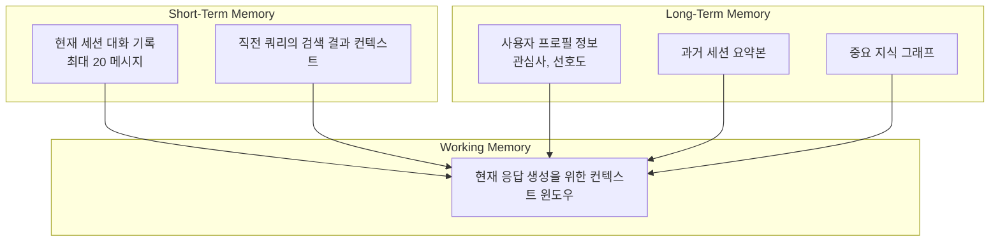

# 04. 메모리 아키텍처 (컨텍스트 유지)

## 다층적 메모리 구조

사용자의 컨텍스트를 유지하기 위한 다층적 메모리 아키텍처입니다.



## 단기 기억 (Short-Term Memory)

| 항목 | 설명 | 저장소 | TTL |
|------|------|--------|-----|
| 세션 대화 기록 | 최근 N개의 메시지 쌍 (user/assistant) | Redis | 세션 만료 시 (30분 비활성) |
| 검색 컨텍스트 | 직전 RAG 검색 결과 Top-N | Redis | 1회 응답 후 삭제 |
| 현재 프롬프트 상태 | 시스템 프롬프트 + 파라미터 | 메모리 | 요청 단위 |

### 대화 기록 스키마

```json
{
    "session_id": "sess_abc123",
    "messages": [
        {
            "role": "user",
            "content": "안녕하세요, PDF 문서에 대해 질문이 있습니다.",
            "timestamp": "2026-05-04T01:00:00Z"
        },
        {
            "role": "assistant", 
            "content": "네, 무엇을 도와드릴까요?",
            "timestamp": "2026-05-04T01:00:02Z",
            "sources": ["doc_abc123_page_5"]
        }
    ],
    "created_at": "2026-05-04T01:00:00Z",
    "last_active": "2026-05-04T01:00:02Z"
}
```

## 장기 기억 (Long-Term Memory)

| 항목 | 설명 | 저장소 | 갱신 주기 |
|------|------|--------|-----------|
| 사용자 프로필 | 이름, 역할, 관심 분야, 언어 선호도 | PostgreSQL | 세션 간 유지 |
| 세션 요약본 | 각 세션 종료 시 LLM이 생성한 요약 | PostgreSQL | 세션 종료 시 |
| 지식 그래프 | 문서 간 관계, 핵심 개념 연결 | Neo4j (선택사항) | 문서 업로드 시 |

### 사용자 프로필 스키마

```json
{
    "user_id": "user_001",
    "profile": {
        "name": "홍길동",
        "role": "개발자",
        "interests": ["Python", "AI", "RAG"],
        "preferred_language": "ko"
    },
    "created_at": "2026-05-01T00:00:00Z",
    "updated_at": "2026-05-04T01:00:00Z"
}
```

## 컨텍스트 윈도우 구성 로직

```python
async def build_context(session_id: str, query: str) -> dict:
    """현재 응답을 위한 컨텍스트 윈도우를 구성"""
    
    # 1. 단기 기억에서 세션 대화 기록 로드
    recent_messages = await redis.get(f"session:{session_id}:messages")
    
    # 2. RAG 검색 결과 (이미 수행됨)
    rag_context = get_rag_results()
    
    # 3. 장기 기억에서 사용자 프로필 로드
    user_profile = await db.get_user_profile(session_id)
    
    # 4. 컨텍스트 윈도우 구성
    context_window = {
        "system_prompt": SYSTEM_PROMPT_TEMPLATE,
        "user_profile": user_profile,
        "recent_conversation": recent_messages[-10:],  # 최근 10개 메시지
        "rag_context": rag_context,
        "query": query
    }
    
    return context_window
```

## 메모리 관리 정책

| 정책 | 설명 |
|------|------|
| 세션 TTL | 30분 비활성 시 자동 만료 |
| STM 회전 | 최근 20개 메시지만 유지, 초과 시 oldest 삭제 |
| LTM 압축 | 7일 이상 지난 세션은 요약본으로 전환 |
| 지식 그래프 갱신 | 새 문서 업로드 시 관계 추출 및 업데이트 |

## Redis 키 구조

```
session:{session_id}:messages      # 세션 대화 기록 (TTL: 30분)
session:{session_id}:context       # 직전 검색 컨텍스트 (TTL: 1회 응답 후 삭제)
user:{user_id}:profile             # 사용자 프로필 (영구 저장)
summary:{session_id}               # 세션 요약본 (영구 저장)
```

## PostgreSQL 테이블 구조

### users 테이블
| 컬럼 | 타입 | 설명 |
|------|------|------|
| user_id | VARCHAR(36) | PK, UUID |
| name | VARCHAR(100) | 사용자 이름 |
| role | VARCHAR(50) | 역할 |
| interests | JSONB | 관심사 배열 |
| preferred_language | VARCHAR(10) | 언어 선호도 |
| created_at | TIMESTAMP | 생성일 |
| updated_at | TIMESTAMP | 수정일 |

### sessions 테이블
| 컬럼 | 타입 | 설명 |
|------|------|------|
| session_id | VARCHAR(36) | PK, UUID |
| user_id | VARCHAR(36) | FK → users |
| summary | TEXT | 세션 요약본 |
| created_at | TIMESTAMP | 생성일 |
| last_active | TIMESTAMP | 마지막 활동 |
