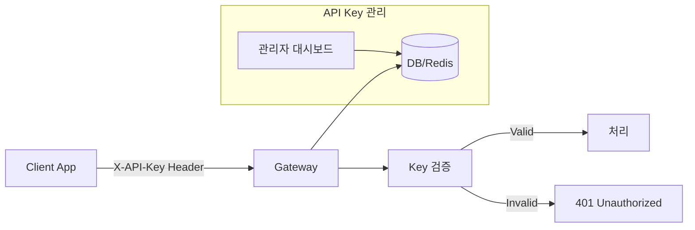

# 05. API 엔드포인트 설계

## 인증 구조 (API Key)



## API 엔드포인트 목록

### 인증

| Method | Endpoint | 설명 | Header |
|--------|----------|------|--------|
| POST | `/api/v1/auth` | API Key 검증 | `X-API-Key: <key>` |

### 채팅

| Method | Endpoint | 설명 | Body |
|--------|----------|------|------|
| POST | `/api/v1/chat` | 채팅 메시지 전송 | `{ "message": "...", "session_id": "..." }` |
| GET | `/api/v1/sessions/{id}` | 세션 조회 | - |
| DELETE | `/api/v1/sessions/{id}` | 세션 삭제 | - |

### 문서 관리

| Method | Endpoint | 설명 | Content-Type |
|--------|----------|------|--------------|
| POST | `/api/v1/documents/upload` | 문서 업로드 (TXT, MD, PDF) | `multipart/form-data` |
| GET | `/api/v1/documents` | 문서 목록 조회 | - |
| DELETE | `/api/v1/documents/{id}` | 문서 삭제 | - |

### 파라미터 설정

| Method | Endpoint | 설명 | Body |
|--------|----------|------|------|
| PUT | `/api/v1/settings` | 파라미터 설정 | `{ "model", "temperature", ... }` |
| GET | `/api/v1/settings` | 현재 설정 조회 | - |

## 상세 API 스펙

### POST /api/v1/chat

**요청**:
```json
{
    "message": "안녕하세요, PDF 문서에 대해 질문이 있습니다.",
    "session_id": "sess_abc123",
    "rag_config": {
        "top_k": 5,
        "rerank_enabled": true
    }
}
```

**응답 (스트리밍)**:
```json
{
    "session_id": "sess_abc123",
    "message_id": "msg_xyz789",
    "content": "안녕하세요! PDF 문서에 대해 궁금한 점이 있으신가요?",
    "sources": [
        {
            "document_id": "doc_001",
            "page": 5,
            "text": "관련 내용..."
        }
    ],
    "timestamp": "2026-05-04T01:00:02Z"
}
```

### POST /api/v1/documents/upload

**요청**:
```
POST /api/v1/documents/upload
Header: X-API-Key: <your-api-key>
Content-Type: multipart/form-data

{
    "file": <binary file>,           # .txt, .md 또는 .pdf 파일
    "metadata": {                     # 선택사항
        "title": "문서 제목",
        "category": "카테고리명",
        "tags": ["태그1", "태그2"]
    }
}
```

**응답 (200 OK)**:
```json
{
    "document_id": "doc_abc123",
    "status": "processing",           # processing | completed | failed
    "chunks_count": 15,
    "images_extracted": 3,            # PDF인 경우 추출된 이미지 수
    "message": "문서가 성공적으로 업로드되었습니다."
}
```

### 파라미터 설정 API 구조

```json
{
    "model": "llama3",
    "temperature": 0.7,
    "max_tokens": 2048,
    "top_p": 0.9,
    "system_prompt": "당신은 친절한 AI 어시스턴트입니다.",
    "rag_config": {
        "top_k": 5,
        "rerank_enabled": true,
        "hybrid_search": true
    }
}
```

## WebSocket 엔드포인트

### ws://host/ws/chat

**연결**:
```javascript
const ws = new WebSocket('ws://chatbot.example.com/ws/chat');
ws.send(JSON.stringify({
    type: 'connect',
    session_id: 'sess_abc123',
    api_key: '<your-api-key>'
}));
```

**메시지 타입**:
| 타입 | 방향 | 설명 |
|------|------|------|
| `message` | Client → Server | 채팅 메시지 전송 |
| `chunk` | Server → Client | 스트리밍 응답 청크 |
| `done` | Server → Client | 응답 완료 |
| `error` | Server → Client | 에러 발생 |
