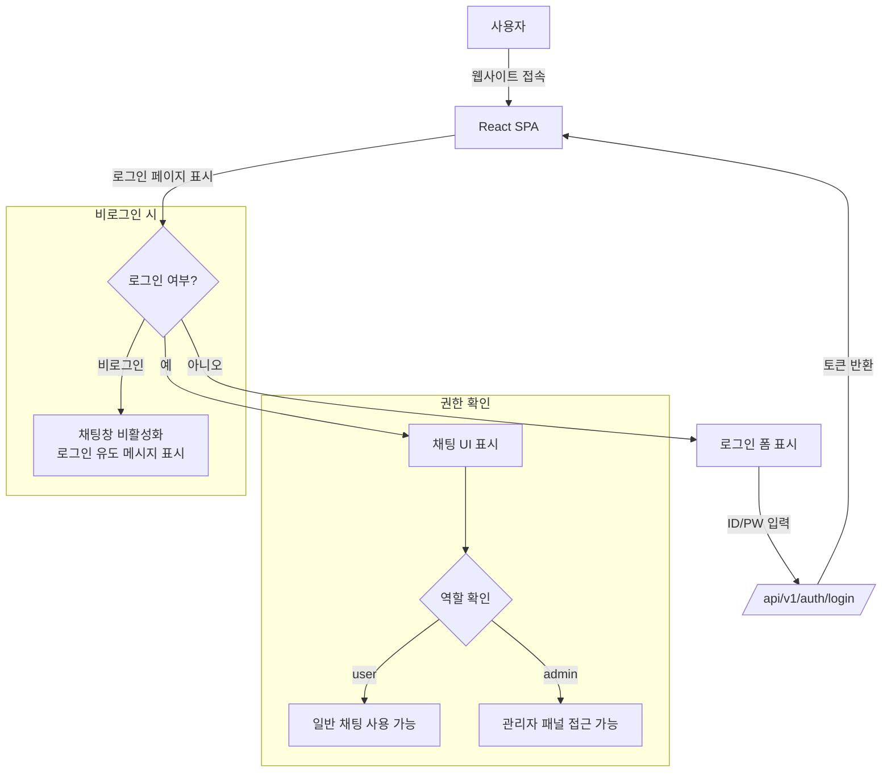

# 09. 인증 및 권한 관리

## 개요

채팅봇 시스템은 두 가지 인증 레이어로 구성됩니다:
1. **API Key 인증**: 백엔드 API 접근 제어 (서버 간 통신)
2. **사용자 로그인**: 프론트엔드 채팅 접근 제어 (일반/관리자 역할 구분)

## 사용자 레벨 구조

| 레벨 | 권한 | 설명 |
|------|------|------|
| 일반 사용자 | 채팅 사용, 세션 관리 | 문서 업로드 불가, 관리자 기능 접근 불가 |
| 관리자 | 전체 기능 접근 | 문서 관리, 설정 변경, 사용자 관리 |

## 로그인 API 엔드포인트

### POST /api/v1/auth/login

**요청**:
```json
{
    "username": "admin",
    "password": "sjaksahffk."
}
```

**응답 (200 OK)**:
```json
{
    "access_token": "eyJhbGciOiJIUzI1NiIs...",
    "token_type": "bearer",
    "user_id": "admin_001",
    "role": "admin",
    "expires_in": 3600
}
```

### POST /api/v1/auth/register (일반 사용자)

**요청**:
```json
{
    "username": "user001",
    "password": "secure_password_123"
}
```

**응답 (201 Created)**:
```json
{
    "user_id": "user_abc123",
    "role": "user",
    "message": "계정이 생성되었습니다."
}
```

## 관리자 계정 초기 설정

### PostgreSQL에서 관리자 계정 생성

```sql
-- users 테이블에 관리자 계정 삽입
INSERT INTO users (user_id, username, password_hash, role, created_at)
VALUES (
    'admin_001',
    'admin',
    '$2b$12$LJ3m4ys...',  -- bcrypt 해시 값
    'admin',
    NOW()
);

-- 일반 사용자 예시
INSERT INTO users (user_id, username, password_hash, role, created_at)
VALUES (
    'user_001',
    'user001',
    '$2b$12$LJ3m4ys...',  -- bcrypt 해시 값
    'user',
    NOW()
);
```

### FastAPI에서 관리자 계정 초기화 코드

```python
# app/auth/initial_data.py
import hashlib
from sqlalchemy.orm import Session
from app.models.user import User
from app.schemas.user import UserRole

ADMIN_USERNAME = "admin"
ADMIN_PASSWORD = "sjaksahffk."  # 실제 운영 시에는 환경변수로 관리

def init_admin_user(db: Session):
    """관리자 계정 초기 생성"""
    from app.auth.security import get_password_hash
    
    admin = db.query(User).filter(User.username == ADMIN_USERNAME).first()
    if not admin:
        admin = User(
            username=ADMIN_USERNAME,
            password_hash=get_password_hash(ADMIN_PASSWORD),
            role=UserRole.ADMIN
        )
        db.add(admin)
        db.commit()
```

## JWT 토큰 기반 인증

### 토큰 생성

```python
# app/auth/security.py
from datetime import datetime, timedelta
from jose import jwt, JWTError
from fastapi import Depends, HTTPException, status
from fastapi.security import OAuth2PasswordBearer

SECRET_KEY = "your-secret-key-change-in-production"
ALGORITHM = "HS256"
ACCESS_TOKEN_EXPIRE_MINUTES = 30

oauth2_scheme = OAuth2PasswordBearer(tokenUrl="/api/v1/auth/login")

def create_access_token(data: dict, expires_delta: timedelta = None):
    to_encode = data.copy()
    expire = datetime.utcnow() + (expires_delta or timedelta(minutes=15))
    to_encode.update({"exp": expire})
    return jwt.encode(to_encode, SECRET_KEY, algorithm=ALGORITHM)

def get_current_user(token: str = Depends(oauth2_scheme)):
    credentials_exception = HTTPException(
        status_code=status.HTTP_401_UNAUTHORIZED,
        detail="잘못된 인증 정보",
    )
    try:
        payload = jwt.decode(token, SECRET_KEY, algorithms=[ALGORITHM])
        username: str = payload.get("sub")
        if username is None:
            raise credentials_exception
    except JWTError:
        raise credentials_exception
    
    user = db.query(User).filter(User.username == username).first()
    if user is None:
        raise credentials_exception
    return user
```

### 역할 기반 접근 제어 (RBAC)

```python
# app/auth/deps.py
from fastapi import Depends, HTTPException, status
from app.models.user import User
from app.schemas.user import UserRole

def require_admin(current_user: User = Depends(get_current_user)):
    if current_user.role != UserRole.ADMIN:
        raise HTTPException(
            status_code=status.HTTP_403_FORBIDDEN,
            detail="관리자 권한이 필요합니다."
        )
    return current_user

def require_user(current_user: User = Depends(get_current_user)):
    if current_user.role not in [UserRole.USER, UserRole.ADMIN]:
        raise HTTPException(
            status_code=status.HTTP_403_FORBIDDEN,
            detail="접근 권한이 없습니다."
        )
    return current_user
```

## 프론트엔드 로그인 페이지 구조

### Login.tsx

```tsx
import React, { useState } from 'react';
import { useAuth } from '../hooks/useAuth';

const LoginPage = () => {
    const [username, setUsername] = useState('');
    const [password, setPassword] = useState('');
    const { login } = useAuth();

    const handleSubmit = async (e: React.FormEvent) => {
        e.preventDefault();
        await login(username, password);
    };

    return (
        <div className="min-h-screen bg-[#F4F5F7] flex items-center justify-center">
            <div className="bg-white p-8 rounded-lg shadow-md w-96 border border-[#D9DBDF]">
                <h1 className="text-xl font-bold text-[#232F3E] mb-6">AI Chatbot 로그인</h1>
                <form onSubmit={handleSubmit}>
                    <div className="mb-4">
                        <label className="block text-sm text-[#6D757D] mb-1">아이디</label>
                        <input
                            type="text"
                            value={username}
                            onChange={(e) => setUsername(e.target.value)}
                            className="w-full px-3 py-2 border border-[#D9DBDF] rounded focus:outline-none focus:border-[#417D90]"
                        />
                    </div>
                    <div className="mb-6">
                        <label className="block text-sm text-[#6D757D] mb-1">비밀번호</label>
                        <input
                            type="password"
                            value={password}
                            onChange={(e) => setPassword(e.target.value)}
                            className="w-full px-3 py-2 border border-[#D9DBDF] rounded focus:outline-none focus:border-[#417D90]"
                        />
                    </div>
                    <button
                        type="submit"
                        className="w-full bg-[#FF8E00] text-white py-2 rounded hover:bg-[#e67e00] transition-colors"
                    >
                        로그인
                    </button>
                </form>
            </div>
        </div>
    );
};

export default LoginPage;
```

## 채팅 접근 제어 흐름



## 보안 권장사항

1. **비밀번호 해싱**: bcrypt 또는 argon2 사용
2. **JWT 만료**: 30분으로 설정, Refresh Token 활용
3. **HTTPS 전환**: 프로덕션에서는 SSL 인증서 필수 적용
4. **API Key 관리**: 환경변수로 관리, 코드에 하드코딩 금지
5. **로그인 시도 제한**: 5회 실패 시 15분 잠금
