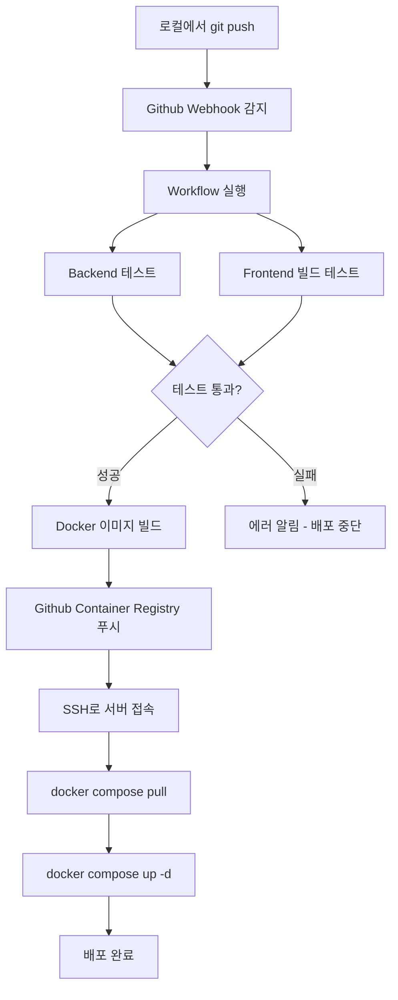

# 10. GitHub Actions CI/CD 파이프라인

## 개요

GitHub Actions를 활용한 자동 빌드 및 배포 파이프라인을 구성합니다.
`main` 브랜치에 push하면 자동으로 테스트 → 빌드 → 서버 배포가 실행됩니다.

## 전체 흐름



## 준비해야 할 작업 (사용자 액션)

### Step 1: GitHub Repository 생성

```bash
# 로컬에서 리포지토리 초기화
cd /home/code-project
git init
git add .
git commit -m "Initial commit"
git branch -M main
git remote add origin https://github.com/your-username/chatbot-rag.git
git push -u origin main
```

### Step 2: GitHub Secrets 설정 (Repository Settings)

1. Repository → **Settings** → **Secrets and variables** → **Actions**
2. 다음 Secret들을 추가합니다:

| Secret 이름 | 값 | 설명 |
|-------------|-----|------|
| `DEPLOY_HOST` | 서버 IP 주소 | 배포할 서버 IP (예: 211.239.158.245) |
| `DEPLOY_USER` | ubuntu 또는 root | SSH 접속 사용자 |
| `DEPLOY_KEY` | SSH 개인키 내용 | 서버 접속용 키 |

### Step 3: SSH 키 생성 (로컬에서)

```bash
# SSH 키 생성 (비밀번호 없이)
ssh-keygen -t ed25519 -C "github-actions" -f ~/.ssh/deploy_key -N ""

# 공개키를 서버에 등록
ssh-copy-id -i ~/.ssh/deploy_key.pub ubuntu@your-server-ip

# 공개키 내용을 GitHub Secret에 복사
cat ~/.ssh/deploy_key.pub
```

### Step 4: 서버에 Docker Compose 설치 확인

```bash
docker --version && docker compose version
```

## 워크플로우 파일 구성

### `.github/workflows/deploy.yml`

```yaml
name: Deploy Chatbot RAG

on:
  push:
    branches: [main]
  pull_request:
    branches: [main]

env:
  REGISTRY: ghcr.io
  IMAGE_NAME: ${{ github.repository }}/chatbot-rag

jobs:
  # ─── Backend 테스트 ──────────────────────
  test-backend:
    runs-on: ubuntu-latest
    steps:
      - uses: actions/checkout@v4

      - name: Set up Python
        uses: actions/setup-python@v5
        with:
          python-version: '3.12'

      - name: Install dependencies
        run: pip install -r backend/requirements.txt

      - name: Run tests
        run: cd backend && pytest tests/ -v --tb=short

  # ─── Frontend 테스트 ─────────────────────
  test-frontend:
    runs-on: ubuntu-latest
    steps:
      - uses: actions/checkout@v4

      - name: Setup Node.js
        uses: actions/setup-node@v4
        with:
          node-version: '20'
          cache: 'npm'
          cache-dependency-path: frontend/package-lock.json

      - name: Install dependencies
        run: cd frontend && npm ci

      - name: Build test
        run: cd frontend && npm run build

  # ─── 배포 (main 브랜치 push 시만) ──────
  deploy:
    needs: [test-backend, test-frontend]
    if: github.ref == 'refs/heads/main' && github.event_name == 'push'
    runs-on: ubuntu-latest

    steps:
      - name: Deploy via SSH
        uses: appleboy/ssh-action@v1.0.3
        with:
          host: ${{ secrets.DEPLOY_HOST }}
          username: ${{ secrets.DEPLOY_USER }}
          key: ${{ secrets.DEPLOY_KEY }}
          port: 22
          script: |
            cd /opt/chatbot

            # 기존 컨테이너 중지 및 제거
            docker compose down || true

            # 최신 이미지 pull
            docker compose pull

            # 새 컨테이너 시작
            docker compose up -d

            # 상태 확인
            docker compose ps

      - name: Notify deployment status
        if: always()
        run: |
          echo "Deployment completed with status: ${{ job.status }}"
```

## 배포 프로세스 요약

| 단계 | 누가 하는가? | 설명 |
|------|-------------|------|
| 코드 작성 | 개발자 (당신) | 로컬에서 개발 |
| `git push` | 개발자 (당신) | GitHub에 푸시 |
| 테스트 실행 | GitHub Actions (자동) | Backend/Frontend 테스트 |
| Docker 빌드 | GitHub Actions (자동) | 이미지 생성 |
| 서버 배포 | GitHub Actions (자동) | SSH로 접속 후 `docker compose up` |

## 주요 특징

- **자동화**: main 브랜치에 push하면 자동으로 테스트 → 빌드 → 배포
- **안전성**: 테스트 실패 시 배포 중단
- **Rollback**: 이전 버전으로 되돌리기 가능 (`git revert`)
- **로그 확인**: `docker compose logs -f api`

## 로컬에서 테스트하는 방법

```bash
# Act 도구를 사용하여 로컬에서 워크플로우 테스트
# https://github.com/nektos/act 설치 후:
act push --secret-file .secrets
```

---

*문서 생성일: 2026-05-04*
