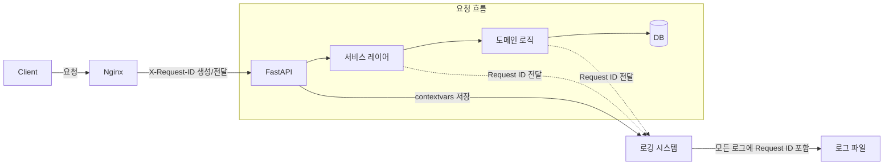

# 13. FastAPI Request ID 추적 미들웨어

## 개요

모든 HTTP 요청에 고유한 UUID를 할당하고, 로깅 시스템에 포함시켜 디버깅과 모니터링을 용이하게 합니다.

## 아키텍처



## 구현 파일들

### 1. Request ID 컨텍스트 (`backend/app/middleware/request_id.py`)

```python
import uuid
from contextvars import ContextVar
from fastapi import Request, Response
from starlette.middleware.base import BaseHTTPMiddleware
from typing import Awaitable, Callable

# 전역 컨텍스트 변수 (비동기 요청 간 공유)
request_id_var: ContextVar[str] = ContextVar("request_id", default=None)


def get_request_id() -> str | None:
    """현재 요청의 Request ID 조회"""
    return request_id_var.get()


class RequestIDMiddleware(BaseHTTPMiddleware):
    """Request ID 미들웨어
    
    각 요청에 고유한 UUID를 할당하고, 응답 헤더에도 포함합니다.
    이미 X-Request-ID 헤더가 있으면 그것을 사용합니다.
    """

    async def dispatch(self, request: Request, call_next) -> Response:
        # 기존 Request ID 확인 또는 새 UUID 생성
        request_id = request.headers.get("x-request-id") or str(uuid.uuid4())
        
        # 컨텍스트에 저장 (비동기 요청 간 공유)
        token = request_id_var.set(request_id)
        
        try:
            response = await call_next(request)
            
            # 응답 헤더에 Request ID 추가
            response.headers["X-Request-ID"] = request_id
            
            return response
        finally:
            # 컨텍스트 정리
            request_id_var.reset(token)


class LoggingMiddleware(BaseHTTPMiddleware):
    """로깅 미들웨어
    
    모든 요청/응답 정보를 로깅합니다.
    """

    async def dispatch(self, request: Request, call_next) -> Response:
        import time
        from app.logger import get_logger
        
        logger = get_logger()
        request_id = get_request_id() or "unknown"
        
        start_time = time.time()
        
        try:
            response = await call_next(request)
            
            duration_ms = (time.time() - start_time) * 1000
            
            # 요청 정보 로깅
            logger.info(
                f"{request.method} {request.url.path}",
                extra={
                    "request_id": request_id,
                    "method": request.method,
                    "path": str(request.url.path),
                    "status_code": response.status_code,
                    "duration_ms": round(duration_ms, 2),
                    "client_ip": request.client.host if request.client else None,
                },
            )
            
            return response
            
        except Exception as e:
            duration_ms = (time.time() - start_time) * 1000
            
            # 에러 로깅
            logger.error(
                f"{request.method} {request.url.path} ERROR",
                extra={
                    "request_id": request_id,
                    "method": request.method,
                    "path": str(request.url.path),
                    "error": str(e),
                    "duration_ms": round(duration_ms, 2),
                },
                exc_info=True,
            )
            
            raise
```

### 2. 커스텀 로거 (`backend/app/logger.py`)

```python
import logging
import sys
from logging.config import dictConfig
from contextvars import copy_context
from app.middleware.request_id import get_request_id


class RequestIDFilter(logging.Filter):
    """로깅 필터 - 모든 로그에 Request ID 추가"""
    
    def filter(self, record: logging.LogRecord) -> bool:
        request_id = get_request_id()
        record.request_id = request_id or "N/A"
        return True


def setup_logger(name: str = None) -> logging.Logger:
    """로거 설정"""
    log_config = {
        "version": 1,
        "disable_existing_loggers": False,
        "formatters": {
            "standard": {
                "format": "%(asctime)s [%(levelname)s] %(name)s - %(request_id)s - %(message)s",
                "datefmt": "%Y-%m-%d %H:%M:%S",
            },
            "json": {
                "()": "pythonjsonlogger.jsonlogger.JsonFormatter",
                "format": "%(asctime)s %(levelname)s %(name)s %(request_id)s %(message)s",
            },
        },
        "handlers": {
            "console": {
                "class": "logging.StreamHandler",
                "formatter": "standard",
                "stream": sys.stdout,
            },
            "file": {
                "class": "logging.handlers.RotatingFileHandler",
                "filename": "/var/log/chatbot/app.log",
                "maxBytes": 10485760,  # 10MB
                "backupCount": 5,
                "formatter": "json",
            },
        },
        "root": {
            "level": "INFO",
            "handlers": ["console", "file"],
        },
    }
    
    dictConfig(log_config)
    
    logger = logging.getLogger(name or __name__)
    logger.addFilter(RequestIDFilter())
    
    return logger


def get_logger(name: str = None) -> logging.Logger:
    """로거 가져오기"""
    return setup_logger(name)
```

### 3. 미들웨어 등록 (`backend/app/main.py`)

```python
from fastapi import FastAPI
from app.middleware.request_id import RequestIDMiddleware, LoggingMiddleware

app = FastAPI(title="Chatbot RAG API")

# 미들웨어 등록 (순서 중요 - 위에서 아래로 실행)
app.add_middleware(RequestIDMiddleware)
app.add_middleware(LoggingMiddleware)


@app.get("/health")
async def health_check():
    """헬스체크 엔드포인트"""
    return {"status": "ok"}
```

## 사용 예시

### 서비스 레이어에서 Request ID 활용

```python
# app/services/chat_service.py
from app.middleware.request_id import get_request_id
from app.logger import get_logger


async def process_chat_message(session_id: str, message: str):
    """채팅 메시지 처리"""
    
    # 현재 요청의 Request ID 가져오기
    request_id = get_request_id()
    logger = get_logger()
    
    logger.info(f"Processing chat message", extra={"session_id": session_id})
    
    try:
        # RAG 엔진 호출 등...
        result = await rag_engine.generate(session_id, message)
        
        logger.info("Chat response generated successfully")
        return result
        
    except Exception as e:
        logger.error(f"Failed to process chat message", exc_info=True)
        raise
```

### 에러 핸들링에서 Request ID 활용

```python
# app/middleware/error_handler.py
from fastapi import Request, status
from fastapi.responses import JSONResponse
from app.middleware.request_id import get_request_id
from app.logger import get_logger


async def global_exception_handler(request: Request, exc: Exception):
    """글로벌 예외 핸들러"""
    
    request_id = get_request_id() or "unknown"
    logger = get_logger()
    
    # 에러 로깅 (Request ID 포함)
    logger.error(
        f"Unhandled exception in {request.method} {request.url.path}",
        extra={"request_id": request_id},
        exc_info=True,
    )
    
    return JSONResponse(
        status_code=status.HTTP_500_INTERNAL_SERVER_ERROR,
        content={
            "error": "Internal Server Error",
            "request_id": request_id,  # 클라이언트에 Request ID 반환
        },
        headers={"X-Request-ID": request_id},
    )


# main.py에 등록
app.add_exception_handler(Exception, global_exception_handler)
```

## 로그 출력 예시

### 콘솔 로그
```
2026-05-04 13:00:02 [INFO] app.services.chat_service - a1b2c3d4-e5f6-7890-abcd-ef1234567890 - Processing chat message
2026-05-04 13:00:03 [INFO] app.middleware.request_id - a1b2c3d4-e5f6-7890-abcd-ef1234567890 - POST /api/v1/chat 200 (45.2ms)
```

### JSON 로그 파일
```json
{
    "asctime": "2026-05-04T13:00:02",
    "levelname": "INFO",
    "name": "app.services.chat_service",
    "request_id": "a1b2c3d4-e5f6-7890-abcd-ef1234567890",
    "message": "Processing chat message"
}
```

## Nginx에서 Request ID 전달 설정

```nginx
location /api/ {
    proxy_pass http://api:8000/api/;
    
    # 클라이언트에서 보낸 X-Request-ID 전달, 없으면 생성
    proxy_set_header X-Request-ID $http_x_request_id;
    
    # 기타 헤더...
}
```

## 디버깅 팁

1. **특정 요청의 전체 로그 추적**: `grep "a1b2c3d4-e5f6" /var/log/chatbot/app.log`
2. **에러 발생 시 클라이언트에 Request ID 반환** → 서버 로그에서 해당 ID로 검색
3. **Nginx + FastAPI 간 문제 분리**: 양쪽 모두에 Request ID 포함

---

*문서 생성일: 2026-05-04*
