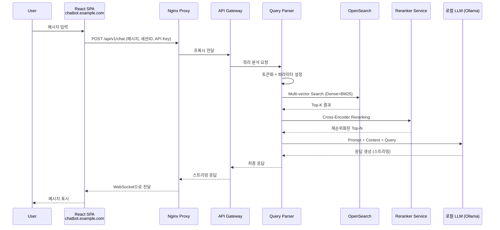
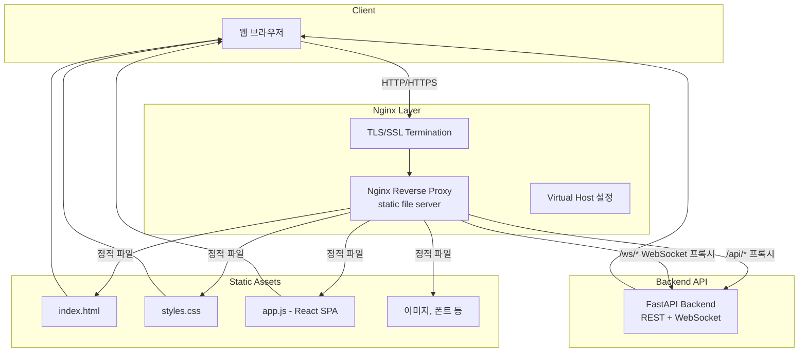
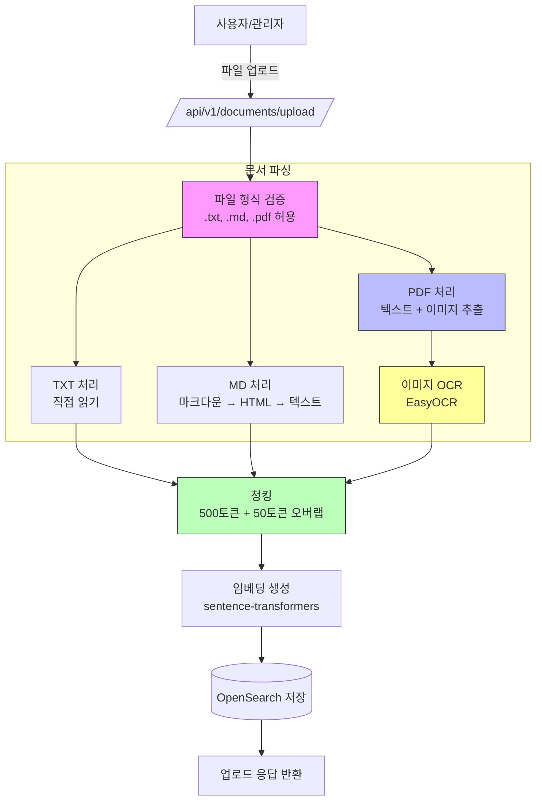
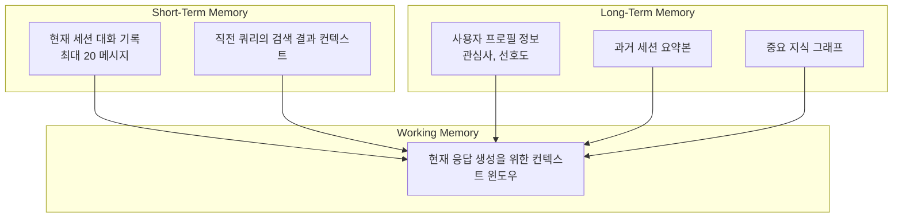
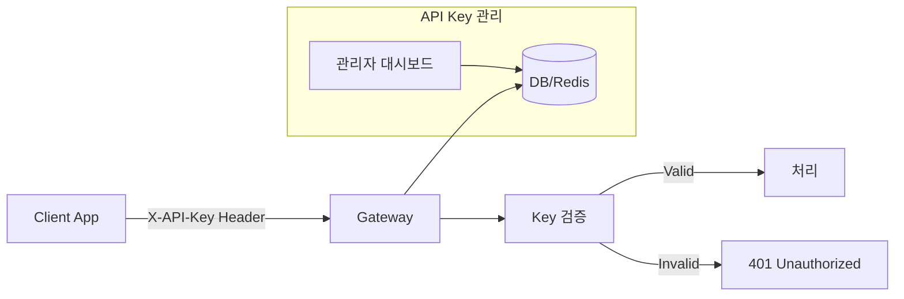

# RAG 기반 AI 채팅봇 시스템 아키텍처

## 1. 시스템 구성 요소

```mermaid
graph TB
    subgraph "Frontend Layer"
        Browser[웹 브라우저]
        ReactSPA[React SPA<br/>chatbot.example.com]
        User[사용자]
    end
    
    subgraph "Nginx Layer"
        NGINX[Nginx Reverse Proxy<br/>SSL Termination]
        StaticFiles[정적 파일 서버]
    end
    
    subgraph "API Gateway / Middleware"
        Auth[인증/인가 서버 (API Key)]
        Router[API 라우터]
        ParamConfig[파라미터 설정 API]
        RateLimit[Rate Limiter]
    end
    
    subgraph "RAG Engine"
        QueryParser[쿼리 파서 & 전처리]
        Embedding[임베딩 생성기]
        VectorSearch[OpenSearch Vector Search]
        Ranker[Cross-Encoder Ranker]
        RRF[Reranker (RRF)]
    end
    
    subgraph "LLM Layer"
        LLM[로컬 LLM API<br/>http://211.239.158.245:11434]
        PromptEngine[Prompt Engineering]
        ContextBuilder[Context Builder]
    end
    
    subgraph "Data Pipeline"
        DocumentLoader[문서 로더 (TXT, PDF, Image)]
        Chunker[청커]
        EmbeddingStore[OpenSearch Index]
    end
    
    User -->|HTTP/HTTPS| Browser
    Browser -->|React SPA| ReactSPA
    ReactSPA -->|REST + WebSocket| NGINX
    NGINX -->|정적 파일| StaticFiles
    NGINX -->|API 프록시| Auth
    Auth --> Router
    Router --> QueryParser
    QueryParser --> Embedding
    Embedding --> VectorSearch
    VectorSearch --> Ranker
    Ranker --> RRF
    RRF --> ContextBuilder
    ContextBuilder --> PromptEngine
    PromptEngine --> LLM
    LLM -->|응답| ReactSPA
    
    DocumentLoader --> Chunker
    Chunker --> Embedding
    Embedding --> EmbeddingStore
```

## 2. OpenSearch 검색 정확도 개선 전략 (핵심)

### A. Multi-Vector Search + RRF (Reciprocal Rank Fusion)
- 단일 쿼리가 아닌, 의미적으로 유사한 여러 쿼리를 생성하여 병렬 검색
- 각 인덱스(semantic, keyword, hybrid)에서 반환된 결과를 RRF 알고리즘으로 재순위화
- **RRF 공식**: `score = Σ (1 / (k + rank_i))` (k=60)

### B. Cross-Encoder Ranker (2-stage retrieval)
```
Stage 1: Vector Search (Fast, recall-focused) → Top-K 문서 (예: K=100)
Stage 2: Cross-Encoder Reranker (Slow, precision-focused) → Top-N 문서 (예: N=5)
```
- **추천 모델**: `BAAI/bge-reranker-v2-m3`, `jina-reranker-v2-base-multilingual`
- Cross-Encoder는 쿼리-문서 쌍을 직접 처리하므로 훨씬 높은 정확도

### C. Hybrid Search (Dense + Sparse)
| 방식 | 설명 | 역할 |
|------|------|------|
| Dense Vector | Sentence-BERT 임베딩 | 의미적 유사성 검색 |
| Sparse (BM25) | OpenSearch BM25 | 키워드 매칭 검색 |
| RRF 결합 | 두 결과 조합 | 상호 보완적 검색 |

### D. Query Expansion & Rewriting
- LLM을 활용해 쿼리를 재작성 (Query Rewriting)
- 관련 질문 생성 (Query Expansion)
- 한국어 특화: 형태소 분석기(KoNLPy, Komoran)를 통한 어간 추출

## 3. 상세 아키텍처



## 4. 기술 스택 제안

| 레이어 | 기술 | 비고 |
|--------|------|------|
| Frontend | React SPA (Vite 빌드) + TypeScript | chatbot.example.com 도메인 |
| Web Server | Nginx (Reverse Proxy + Static Files) | SSL, WebSocket 프록시 |
| API Gateway | FastAPI (Python) | REST + WebSocket 지원 |
| Vector DB | OpenSearch 2.x+ (k-NN plugin) | k-NN 검색 플러그인 필수 |
| Embedding Model | `sentence-transformers/all-MiniLM-L6-v2` 또는 한국어 특화 모델 |
| Reranker | BAAI/bge-reranker-v2-m3 | 다국어 지원, 성능 우수 |
| LLM | 로컬 LLM (Ollama) | http://211.239.158.245:11434 |
| Document Pipeline | LangChain / LlamaIndex | 문서 파싱 및 청킹 |
| Session Storage | Redis + PostgreSQL | 단기/장기 메모리 분리 |

## 5. Nginx + 동적 모듈 프론트엔드 구조



### A. Nginx 설정 예시

```nginx
server {
    listen 443 ssl http2;
    server_name chatbot.example.com;

    # SSL 인증서
    ssl_certificate /etc/ssl/certs/chatbot.crt;
    ssl_certificate_key /etc/ssl/private/chatbot.key;

    # 정적 파일 서빙 (React SPA)
    root /var/www/chatbot/dist;
    index index.html;

    # React Router 지원 (SPA 라우팅)
    location / {
        try_files $uri $uri/ /index.html;
        
        # 캐시 제어
        location ~* \.(js|css|png|jpg|jpeg|gif|ico|svg|woff2?)$ {
            expires 1y;
            add_header Cache-Control "public, immutable";
        }
    }

    # API 프록시 (REST)
    location /api/ {
        proxy_pass http://127.0.0.1:8000/api/;
        proxy_http_version 1.1;
        proxy_set_header Host $host;
        proxy_set_header X-Real-IP $remote_addr;
        proxy_set_header X-Forwarded-For $proxy_add_x_forwarded_for;
        proxy_set_header X-API-Key $http_x_api_key;
        
        # 타임아웃 설정
        proxy_connect_timeout 60s;
        proxy_send_timeout 120s;
        proxy_read_timeout 120s;
    }

    # WebSocket 프록시 (실시간 스트리밍)
    location /ws/ {
        proxy_pass http://127.0.0.1:8000/ws/;
        proxy_http_version 1.1;
        proxy_set_header Upgrade $http_upgrade;
        proxy_set_header Connection "upgrade";
        proxy_set_header Host $host;
        proxy_set_header X-Real-IP $remote_addr;
        
        # WebSocket 타임아웃 (긴 연결 유지)
        proxy_read_timeout 86400s;
        proxy_send_timeout 86400s;
    }

    # 보안 헤더
    add_header X-Frame-Options SAMEORIGIN;
    add_header X-Content-Type-Options nosniff;
    add_header X-XSS-Protection "1; mode=block";
}
```

### B. React SPA 구조 (동적 모듈)

```
chatbot-frontend/
├── public/
│   ├── index.html              # 진입점
│   └── favicon.ico
├── src/
│   ├── components/
│   │   ├── ChatWindow.tsx      # 채팅창 컴포넌트
│   │   ├── MessageBubble.tsx   # 메시지 버블 (user/assistant)
│   │   ├── TypingIndicator.tsx # 입력 중 표시기
│   │   └── SourceReference.tsx # 참조 소스 표시
│   ├── hooks/
│   │   ├── useWebSocket.ts     # WebSocket 커넥션 관리
│   │   └── useChatSession.ts   # 세션 상태 관리
│   ├── services/
│   │   ├── api.ts              # REST API 호출
│   │   └── websocket.ts        # WebSocket 통신
│   ├── App.tsx                 # 메인 앱 컴포넌트
│   └── index.tsx               # 진입점
├── package.json
└── nginx.conf                  # Nginx 설정 파일
```

### C. 채팅 위젯 UI 구성

| 컴포넌트 | 설명 |
|----------|------|
| 플로팅 버튼 (FAB) | 우측 하단 고정, 클릭 시 채팅창 확장/축소 |
| 채팅창 | 메시지 목록 + 입력 필드 + 파일 업로드 버튼 |
| 메시지 버블 | 사용자(오른쪽 파란색), AI(왼쪽 회색) 구분 |
| 소스 참조 | 응답 하단에 출처 문서 표시 (클릭 시 원문 확인) |
| 로딩 인디케이터 | 스트리밍 응답 중 "입력 중..." 애니메이션 |

### D. 통신 프로토콜

| 타입 | 프로토콜 | 설명 |
|------|----------|------|
| REST API | HTTPS | 문서 업로드, 세션 관리, 초기 채팅 요청 |
| 실시간 응답 | WebSocket (wss://) | LLM 스트리밍 응답 수신 |
| 파일 전송 | HTTPS multipart | TXT/MD/PDF 파일 업로드 |

## 6. API 엔드포인트 설계

| Method | Endpoint | 설명 |
|--------|----------|------|
| POST | `/api/v1/auth` | API Key 검증 |
| POST | `/api/v1/chat` | 채팅 메시지 전송 |
| GET | `/api/v1/sessions/{id}` | 세션 조회 |
| DELETE | `/api/v1/sessions/{id}` | 세션 삭제 |
| POST | `/api/v1/documents/upload` | 문서 업로드 (TXT, PDF) |
| GET | `/api/v1/documents` | 문서 목록 조회 |

## 7. 파라미터 설정 API 구조

```json
{
    "model": "llama3",
    "temperature": 0.7,
    "max_tokens": 2048,
    "top_p": 0.9,
    "system_prompt": "당신은 친절한 AI 어시스턴트입니다.",
    "rag_config": {
        "top_k": 5,
        "rerank_enabled": true,
        "hybrid_search": true
    }
}
```

## 8. 데이터 파이프라인 구조 (상세 설계)

> 현재 프로젝트에는 아직 구현된 코드가 없습니다. 아래는 TXT와 MD 형식을 지원하는 상세 설계입니다.

### 8.1 지원 파일 형식

| 형식 | 설명 | 사용 라이브러리 | 처리 방식 |
|------|------|-----------------|-----------|
| `.txt` | 일반 텍스트 파일 | Python 내장 `open()` | 전체 내용을 텍스트로 읽음 |
| `.md` | Markdown 문서 | `markdown2`, `mistletoe` | 마크다운 파싱 → 순수 텍스트 추출 |
| `.pdf` | PDF 문서 (텍스트+이미지) | `pymupdf`(PyMuPDF), `pdfplumber`, `easyocr` | 텍스트 추출 + 이미지 OCR |

### 8.2 업로드 API 엔드포인트 설계

```python
# POST /api/v1/documents/upload
# Header: X-API-Key: <your-api-key>
# Content-Type: multipart/form-data

{
    "file": <binary file>,           # .txt, .md 또는 .pdf 파일
    "metadata": {                     # 선택사항
        "title": "문서 제목",
        "category": "카테고리명",
        "tags": ["태그1", "태그2"]
    }
}

# 응답 (200 OK)
{
    "document_id": "doc_abc123",
    "status": "processing",           # processing | completed | failed
    "chunks_count": 15,
    "images_extracted": 3,            # PDF인 경우 추출된 이미지 수
    "message": "문서가 성공적으로 업로드되었습니다."
}
```

### 8.3 문서 파싱 로직 (Pseudo-code)

```python
async def parse_document(file_path: str, file_type: str) -> List[str]:
    """문서 파일을 읽고 텍스트 청크로 분할"""
    
    if file_type == "txt":
        content = await read_text_file(file_path)
        
    elif file_type == "md":
        # Markdown 파싱 → HTML → 순수 텍스트 추출
        html = markdown2.markdown(content_raw)
        content = extract_text_from_html(html)
        
    elif file_type == "pdf":
        # PDF 처리: 텍스트 + 이미지 분리 추출
        text_content, images = await parse_pdf_with_images(file_path)
        # 이미지에 대한 OCR 수행
        for img in images:
            ocr_text = await perform_ocr(img)
            content += f"[이미지 설명: {ocr_text}]"
        
    else:
        raise ValueError(f"지원하지 않는 파일 형식: {file_type}")
    
    return chunk_text(content, chunk_size=500, overlap=50)


async def parse_pdf_with_images(pdf_path: str) -> Tuple[str, List[Image]]:
    """PDF에서 텍스트와 이미지를 분리 추출"""
    import fitz  # PyMuPDF
    
    doc = fitz.open(pdf_path)
    full_text = ""
    images = []
    
    for page_num in range(len(doc)):
        page = doc.load_page(page_num)
        
        # 1. 텍스트 추출 (페이지별 메타데이터 유지)
        text = page.get_text()
        full_text += f"[Page {page_num + 1}] {text}\n"
        
        # 2. 이미지 추출
        image_list = page.get_images(full=True)
        for img_index, img in enumerate(image_list):
            xref = img[0]
            base_image = doc.extract_image(xref)
            image_bytes = base_image["image"]
            
            # 이미지를 메모리에 로드
            from PIL import Image
            import io
            img_obj = Image.open(io.BytesIO(image_bytes))
            images.append({
                "page": page_num + 1,
                "index": img_index,
                "data": img_obj,
                "format": base_image["ext"]
            })
    
    doc.close()
    return full_text, images


async def perform_ocr(image: Image) -> str:
    """이미지에서 텍스트 추출 (OCR)"""
    # EasyOCR 사용 (한국어 + 영어 지원)
    import easyocr
    
    reader = easyocr.Reader(['ko', 'en'], gpu=False)
    result = reader.readtext(image)
    
    # OCR 결과 결합
    ocr_text = " ".join([item[1] for item in result])
    return ocr_text


def chunk_text(text: str, chunk_size: int = 500, overlap: int = 50) -> List[str]:
    """텍스트를 의미 있는 청크로 분할"""
    # 1. 문단 단위로 먼저 분할 (개행 기준)
    paragraphs = text.split('\n\n')
    
    chunks = []
    current_chunk = ""
    
    for para in paragraphs:
        if len(current_chunk) + len(para) > chunk_size:
            chunks.append(current_chunk.strip())
            # 오버랩 적용 (이전 청크의 마지막 일부 유지)
            if overlap > 0 and chunks:
                prev_last = chunks[-1].split()[-overlap:] if len(chunks[-1].split()) >= overlap else []
                current_chunk = " ".join(prev_last) + " " + para
            else:
                current_chunk = para
        else:
            current_chunk += "\n\n" + para
    
    if current_chunk.strip():
        chunks.append(current_chunk.strip())
    
    return chunks
```

### 8.4 Markdown 파일 처리 상세

Markdown 파일은 다음과 같은 구조를 가질 수 있으며, 이를 적절히 파싱해야 합니다:

```markdown
# 문서 제목 (H1) → metadata.title에 저장
## 섹션 제목 (H2) → metadata.section에 저장
### 소제목 (H3) → 하위 컨텍스트로 활용

본문 내용...

- 리스트 항목 1
- 리스트 항목 2

> 인용구 → 별도 메타데이터로 처리 가능
```

**추천 파싱 전략**:
- `markdown2` 라이브러리 사용 (Python)
- HTML 변환 후 BeautifulSoup으로 순수 텍스트 추출
- 헤더 구조를 메타데이터로 유지하여 검색 시 컨텍스트 보강

### 8.5 PDF 파일 처리 상세

PDF는 다음과 같은 구성 요소를 포함할 수 있으며, 각각을 적절히 처리해야 합니다:

| 요소 | 처리 방식 | 저장 위치 |
|------|-----------|-----------|
| 텍스트 | PyMuPDF로 페이지별 추출 | `text_chunks` 인덱스 |
| 이미지 (내장) | PyMuPDF로 분리 → EasyOCR로 텍스트화 | `image_ocr_text` 인덱스 |
| 표(Table) | pdfplumber로 구조 분석 | `table_data` 인덱스 |
| 메타데이터 | 제목, 작성자, 생성일 등 | 문서 메타데이터 |

**PDF 처리 파이프라인**:
```
1. PyMuPDF로 PDF 열기
2. 페이지별 텍스트 추출 (페이지 번호 메타데이터 포함)
3. 페이지별 이미지 추출 (PIL로 메모리 로드)
4. 각 이미지에 대해 EasyOCR 수행 → 텍스트화
5. 표가 있는 경우 pdfplumber로 구조 분석
6. 모든 텍스트를 청킹하여 OpenSearch에 저장
7. 이미지 OCR 결과는 별도 인덱스에 메타데이터와 함께 저장
```

### 8.6 전체 데이터 흐름



### 8.7 청킹 전략 상세

| 파라미터 | 값 | 설명 |
|----------|-----|------|
| chunk_size | 500 토큰 | 청크당 최대 토큰 수 |
| overlap | 50 토큰 | 인접 청크 간 중복 토큰 (문맥 유지) |
| separator | `\n\n` | 기본 분할 기준 (문단 단위) |
| min_chunk_size | 100 토큰 | 이보다 작은 청크는 병합 |

## 8.8 메모리 구조 (상세 설계)

사용자의 컨텍스트를 유지하기 위한 다층적 메모리 아키텍처입니다.

### A. 메모리 계층 구조



### B. 단기 기억 (Short-Term Memory)

| 항목 | 설명 | 저장소 | TTL |
|------|------|--------|-----|
| 세션 대화 기록 | 최근 N개의 메시지 쌍 (user/assistant) | Redis | 세션 만료 시 (30분 비활성) |
| 검색 컨텍스트 | 직전 RAG 검색 결과 Top-N | Redis | 1회 응답 후 삭제 |
| 현재 프롬프트 상태 | 시스템 프롬프트 + 파라미터 | 메모리 | 요청 단위 |

**대화 기록 스키마**:
```json
{
    "session_id": "sess_abc123",
    "messages": [
        {
            "role": "user",
            "content": "안녕하세요, PDF 문서에 대해 질문이 있습니다.",
            "timestamp": "2026-05-04T01:00:00Z"
        },
        {
            "role": "assistant",
            "content": "네, 무엇을 도와드릴까요?",
            "timestamp": "2026-05-04T01:00:02Z",
            "sources": ["doc_abc123_page_5"]
        }
    ],
    "created_at": "2026-05-04T01:00:00Z",
    "last_active": "2026-05-04T01:00:02Z"
}
```

### C. 장기 기억 (Long-Term Memory)

| 항목 | 설명 | 저장소 | 갱신 주기 |
|------|------|--------|-----------|
| 사용자 프로필 | 이름, 역할, 관심 분야, 언어 선호도 | PostgreSQL | 세션 간 유지 |
| 세션 요약본 | 각 세션 종료 시 LLM이 생성한 요약 | PostgreSQL | 세션 종료 시 |
| 지식 그래프 | 문서 간 관계, 핵심 개념 연결 | Neo4j (선택사항) | 문서 업로드 시 |

**사용자 프로필 스키마**:
```json
{
    "user_id": "user_001",
    "profile": {
        "name": "홍길동",
        "role": "개발자",
        "interests": ["Python", "AI", "RAG"],
        "preferred_language": "ko"
    },
    "created_at": "2026-05-01T00:00:00Z",
    "updated_at": "2026-05-04T01:00:00Z"
}
```

### D. 컨텍스트 윈도우 구성 로직

```python
async def build_context(session_id: str, query: str) -> dict:
    """현재 응답을 위한 컨텍스트 윈도우를 구성"""
    
    # 1. 단기 기억에서 세션 대화 기록 로드
    recent_messages = await redis.get(f"session:{session_id}:messages")
    
    # 2. RAG 검색 결과 (이미 수행됨)
    rag_context = get_rag_results()
    
    # 3. 장기 기억에서 사용자 프로필 로드
    user_profile = await db.get_user_profile(session_id)
    
    # 4. 컨텍스트 윈도우 구성
    context_window = {
        "system_prompt": SYSTEM_PROMPT_TEMPLATE,
        "user_profile": user_profile,
        "recent_conversation": recent_messages[-10:],  # 최근 10개 메시지
        "rag_context": rag_context,
        "query": query
    }
    
    return context_window
```

### E. 메모리 관리 정책

| 정책 | 설명 |
|------|------|
| 세션 TTL | 30분 비활성 시 자동 만료 |
| STM 회전 | 최근 20개 메시지만 유지, 초과 시 oldest 삭제 |
| LTM 압축 | 7일 이상 지난 세션은 요약본으로 전환 |
| 지식 그래프 갱신 | 새 문서 업로드 시 관계 추출 및 업데이트 |

## 8.9 PDF 처리 Phase 비교

### 현재 설계 (Phase 6 - 확장 기능)

| 항목 | 설명 |
|------|------|
| 구현 시기 | 모든 기본 기능이 완료된 후 |
| 우선순위 | 낮음 |
| 개발 리소스 | 추가 페이즈로 분리 |
| 출시 일정 | 최종 버전 |

### Phase 1로 상향 조정 시

| 항목 | 설명 |
|------|------|
| 구현 시기 | 첫 번째 페이즈에서 함께 구현 |
| 우선순위 | 높음 (TXT/MD/PDF 동시 지원) |
| 개발 리소스 | 문서 파싱 모듈에 PDF 포함 |
| 출시 일정 | v1.0부터 PDF 지원 |

**Phase 1로 상향 조정 시의 차이점**:

| 비교 항목 | Phase 6 (현재) | Phase 1 (상향 조정) |
|-----------|----------------|---------------------|
| **개발 기간** | 추가 2주 | 병렬 개발로 1주 증가 |
| **테스트 범위** | 별도 테스트 페이즈 | 전체 통합 테스트 포함 |
| **사용자 경험** | TXT/MD만 지원 → 추후 PDF | 처음부터 모든 형식 지원 |
| **인프라 비용** | 낮음 (PDF 처리 서버 불필요) | 높음 (OCR GPU 필요 시 추가) |
| **보안 리스크** | 낮음 | PDF 악성 코드 검증 로직 추가 필요 |

**권장 사항**: 소규모 서비스(10명 미만)이므로 **Phase 1로 상향 조정 권장**. PDF 처리는 TXT/MD와 병렬로 개발 가능하고, 사용자 경험이 크게 향상됩니다.
| 단계 | 기능 | 예상 시기 |
|------|------|-----------|
| Phase 1 | TXT 기반 RAG (현재) | 우선 구현 |
| Phase 2 | PDF 문서 파싱 (PyPDF2, pdfplumber) | 다음 단계 |
| Phase 3 | 이미지 OCR + 텍스트 추출 (Tesseract) | 그 다음 |

## 9. 인증 구조 (API Key)



## 10. 인프라 구성 (소규모)

| 서비스 | 호스트 | 메모리 | 비고 |
|--------|--------|--------|------|
| OpenSearch | 별도 서버 | 8GB+ | k-NN 플러그인 포함 |
| API Gateway | 별도 서버 | 4GB+ | FastAPI + Uvicorn |
| Reranker Service | 별도 서버 | 8GB+ | bge-reranker-v2-m3 |
| 로컬 LLM | 211.239.158.245 | GPU 권장 | Ollama |

## 11. 구현 로드맵 (Implementation Roadmap)

### Phase 1: 인프라 구축 및 기본 RAG 파이프라인 (우선순위 1)

| 순서 | 작업 | 설명 | 산출물 |
|------|------|------|--------|
| 1-1 | OpenSearch 설치 및 설정 | k-NN 플러그인 포함 버전 설치, 인덱스 스키마 정의 | OpenSearch 서버 준비 완료 |
| 1-2 | 임베딩 모델 배포 | `sentence-transformers/all-MiniLM-L6-v2` 또는 한국어 특화 모델 로컬 배포 | 임베딩 API 엔드포인트 |
| 1-3 | 문서 파이프라인 구축 | TXT 파일 업로드 → 청킹 → 임베딩 → OpenSearch 저장 | `/api/v1/documents/upload` API |
| 1-4 | RAG 엔진 개발 | 쿼리 → 임베딩 → Vector Search → Context 추출 | RAG 검색 모듈 |

### Phase 2: LLM 연동 및 채팅 API (우선순위 2)

| 순서 | 작업 | 설명 | 산출물 |
|------|------|------|--------|
| 2-1 | 로컬 LLM 연결 | http://211.239.158.245:11434 API 연동 (OpenAI 호환 형식) | LLM 클라이언트 모듈 |
| 2-2 | Prompt Engineering | RAG용 프롬프트 템플릿 설계 및 테스트 | `prompt_template.md` |
| 2-3 | 채팅 API 개발 | `/api/v1/chat` 엔드포인트 (스트리밍 응답 지원) | REST API 서버 |
| 2-4 | 세션 관리 | 세션별 대화 기록 저장/조회 (SQLite 또는 PostgreSQL) | Session Manager |

### Phase 3: 검색 정확도 개선 (우선순위 3)

| 순서 | 작업 | 설명 | 산출물 |
|------|------|------|--------|
| 3-1 | Hybrid Search 적용 | Dense Vector + BM25 RRF 결합 | 검색 모듈 v2 |
| 3-2 | Cross-Encoder Ranker | `bge-reranker-v2-m3` 모델 연동 (2-stage retrieval) | Reranker Service |
| 3-3 | Query Rewriting | LLM 기반 쿼리 재작성 기능 | Query Processor v2 |
| 3-4 | 평가 및 튜닝 | 검색 품질 측정 (NDCG, MRR 지표) | Evaluation Report |

### Phase 4: 프론트엔드 개발 (우선순위 4) - 변경됨

| 순서 | 작업 | 설명 | 산출물 |
|------|------|------|--------|
| 4-1 | React SPA 구축 | Vite + TypeScript 기반 채팅 UI | chatbot.example.com |
| 4-2 | Nginx 설정 | Reverse Proxy, SSL, WebSocket 프록시 | nginx.conf |
| 4-3 | WebSocket 연동 | 실시간 스트리밍 응답 구현 | useWebSocket.ts |
| 4-4 | 배포 테스트 | 도메인 연결 + SSL 인증서 적용 | 프로덕션 환경 |

### Phase 5: 인증 및 관리 기능 (우선순위 5)

| 순서 | 작업 | 설명 | 산출물 |
|------|------|------|--------|
| 5-1 | API Key 인증 | X-API-Key Header 검증 미들웨어 | Auth Middleware |
| 5-2 | 관리자 대시보드 | 문서 관리, 세션 조회, 통계 | Admin Dashboard (React) |
| 5-3 | 파라미터 설정 UI | temperature, top_p 등 실시간 조정 | Parameter Config Panel |

### Phase 6: 확장 기능 (우선순위 6 - 향후)

| 순서 | 작업 | 설명 | 산출물 |
|------|------|------|--------|
| 6-1 | 이미지 OCR | Tesseract / EasyOCR 연동 | 이미지 업로드 지원 |
| 6-2 | 다중 모델 지원 | 여러 LLM 모델 선택 기능 | Model Router |
| 6-3 | 지식 그래프 | Neo4j 기반 문서 관계 분석 | Knowledge Graph |

---

*작성일: 2026-05-04*
